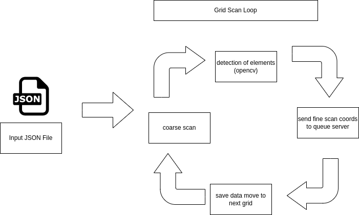
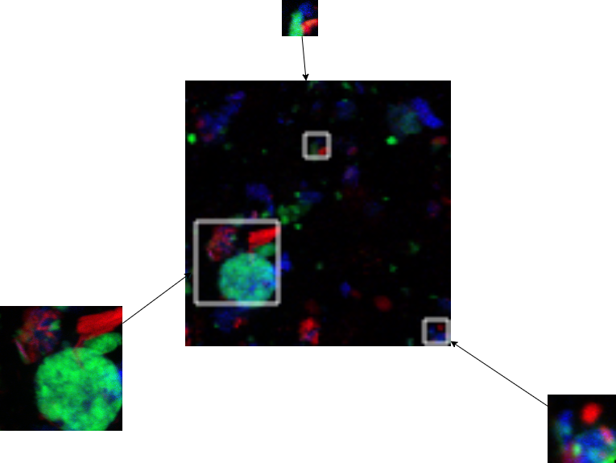

# X-AutoMap

**X-AutoMap** is a **Brookhaven National Laboratory (BNL)** project that accelerates NSLS-II beamline experiments by automatically finding, prioritizing, and queuing regions of interest for follow-up scans. The toolkit combines computer vision, interactive curation, and headless scripts that push fully parameterized scans to the Bluesky Queue Server.

## Project

X-AutoMap uses OpenCV driven blob detection to isolate areas of interest, then merges element-specific TIFF channels into RGB composites for visual inspection. Every processed scan saves TIFF imagery and JSON metadata side by side, making it easy to reload, export, or hand off to downstream tools. Once regions are approved, the same data structure is dispatched to the Queue Server automatically—no manual transcription required. The toolkit ships with both GUI and headless interfaces, plus dedicated viewers for exploring finished scans and mosaics.

## About the Codebase

- **Interactive GUI (`main.py`)** – PyQt-based desktop app where users select directories, configure microns-per-pixel, adjust per-element thresholds, visualize blobs/unions, and export queue-ready JSON. `AppState` centralizes paths, calibration values, and cached blobs, while `utils.py` provides operations such as normalization, morphology, entropy calculations, and queue submission helpers.
- **Automation utilities (`utils.py`, `main_headless.py`, `app_state.py`)** – Wrappers around Bluesky’s Queue Server (`BPlan`, `REManagerAPI`) plus helper routines (`headless_send_queue_coarse_scan`, `headless_send_queue_fine_scan`, `save_each_blob_as_individual_scan`, etc.) that watch the `data/input` directory for JSON instructions and send scans without launching the GUI.
- **Visualization tools (`ScanDetailViewer.py`, `ScanMosaicViewer.py`, `ScanMosaic3by3.py`, `stitched_grid_8_by_8.py`)** – Standalone viewers for reviewing merged coarse scans, stitched grids, and 3×3 or 8x8 mosaics. The detail viewer now supports multiple element groupings (CuCaFe, FeCaSi, CrFeMn) and keeps each processed scan in a group-specific folder for clarity.
- **Processing scripts (`fine_scan_organizer.py`, `fine_scans_type_display.py`, `fine_scan_organizer.py`)** – Command-line helpers that batch-merge TIFF channels into RGB PNGs, organize outputs into ID ranges, and create marketing/QA panels illustrating representative fine-scan types.

## Usage

### Prerequisites
- Python 3.9+
- Packages: `PyQt5`, `numpy`, `opencv-python`, `Pillow`, `tifffile`, `scikit-image`
- Optional (for queue submission): `bluesky-queueserver-api`, `hxntools`

### Interactive workflow
1. Run either `python main.py` for the full GUI or `python main_headless.py` for the scripted pipeline.
2. The mosaic (coarse) scan collects detector data, OpenCV routines analyze each channel to pick AOIs, and the queue server receives the regions automatically.
3. Fine scans execute over those AOIs and every TIFF plus JSON artifact is saved into element-specific folders named after the scan number (for example `data/scans_grouped/367582_CuCaFe`).

### Headless automation

1. Place `initial_scan.json` (and any supporting files) into `data/input/`.
2. Adjust `real_or_test` at the top of `main_headless.py` (`0` = coarse scan test mode, `1` = grid-scan mode).
3. Run `python main_headless.py`. The script loads parameters, triggers the appropriate scan loop.

### Reviewing processed scans
- **Detailed viewer:** `python ScanDetailViewer.py` loads merged coarse scans from `data/scans_grouped/SCANID_<Elements>` folders, overlays union boxes, and displays associated fine scans. Use the arrow keys or buttons to navigate between scans and element groups.
- **Stitched mosaics:** `python ScanMosaicViewer.py` or `python ScanMosaic3by3.py` create large grids that preserve box annotations, useful for spotting spatial trends across the wafer.
- **Fine-scan typology display:** `python fine_scans_type_display.py` builds a 3×3 showcase image that demonstrates “Separate/Together/Partial” behaviors along with scale bars.

### Generating RGB composites for batches
Run `python fine_scan_organizer.py` to iterate over predefined scan ranges, merge Ca/Fe/Cu (etc) TIFF channels, and write normalized RGB PNGs into organized subdirectories under `~/Data/FineImages`.

## Repository layout

| Path | Description |
| --- | --- |
| `main.py` | Interactive Qt application |
| `main_headless.py` | Non-GUI automation entry point |
| `ScanDetailViewer.py` | Review tool for coarse and fine scans grouped by element bundle |
| `utils.py` | Blob detection, normalization, Bluesky queue helpers |
| `ScanMosaicViewer.py`, `ScanMosaic3by3.py`, `stitched_grid_8_by_8.py` | Mosaic/overview viewers |
| `fine_scan_organizer.py`, `fine_scans_type_display.py` | Batch processing & visualization utilities |
